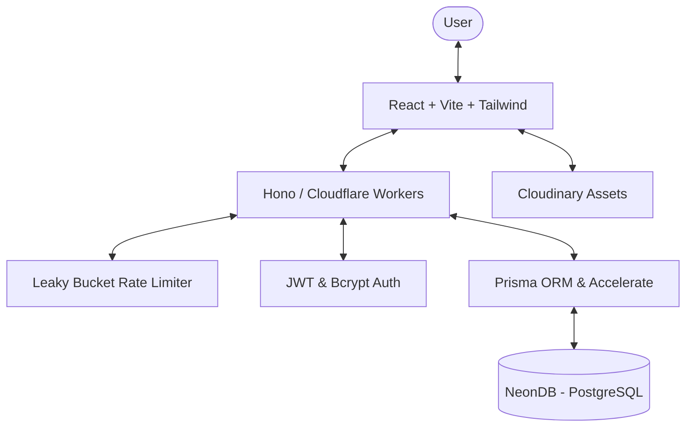

<p align="center">
  
</p>

# <p align="center">✨ ShareIt - A Modern Blogging Platform ✨</p>

<p align="center">
  <a href="https://share-it-nine.vercel.app/">
    
  </a>
  <a href="LICENSE">
    
  </a>
  
</p>

<p align="center">
  
</p>

---

## 🌟 Overview

**ShareIt** is a high-performance, minimalistic blogging ecosystem designed for modern creators. Built with a focus on speed, security, and developer experience, it leverages a cutting-edge serverless architecture to deliver a seamless reading and writing experience.

Whether you're sharing technical insights or personal stories, ShareIt provides the tools you need to create beautiful, categorized content with ease.

---

## ✨ Key Features

### 🔐 Secure Authentication & User Management
- **Advanced Encryption**: Passwords hashed with `bcryptjs` for maximum security.
- **JWT Protection**: Secure session management using JSON Web Tokens.
- **Custom Authorization**: Granular access control for blog management.

### ✍️ Premium Writing Experience
- **Interactive Editor**: Rich Text capabilities powered by **Tiptap** and **Lucide React**.
- **Media Support**: Seamless image uploads directly to **Cloudinary**.
- **Categorization**: Organize your thoughts with flexible blog categories.

### 🚀 Built for Scale & Performance
- **Serverless Backend**: Powered by **Hono** on **Cloudflare Workers** for sub-second latency.
- **Optimized Database**: **Prisma Accelerate** provides advanced connection pooling for NeonDB.
- **Frontend Speed**: Intelligent asset management using **React Suspense**, **Lazy Loading**, and **Data Prefetching**.
- **Resilient Security**: Custom **Leaky Bucket Rate Limiting** protects the API from abuse.

---

## 🛠️ Technical Architecture

ShareIt follows a modern decoupled architecture, ensuring scalability and ease of maintenance.



---

## 🧰 Tech Stack

| Layer | Technology |
| :--- | :--- |
| **Frontend** | React 18, Vite, TailwindCSS, Chakra UI, Framer Motion |
| **Backend** | Hono, Cloudflare Workers, Node.js |
| **Database** | NeonDB (PostgreSQL), Prisma ORM |
| **Storage** | Cloudinary (Image Hosting) |
| **Deployment**| Vercel (Frontend), Cloudflare Workers (Backend) |
| **Utilities** | Axios, Lucide React, Tiptap Editor, Resend |

---

## 📸 visual Gallery

### **Interface Overview**
<p align="center">
  
  
  
</p>

### **Seamless Writing & Reading**
<p align="center">
  
  
  
  
</p>

---

## 🚀 Installation & Setup

Follow these steps to get a local development environment running.

### 1. Clone the Repository
```bash
git clone https://github.com/chitranshuajmera0000/ShareIt.git
cd ShareIt
```

### 2. Install Dependencies
```bash
npm install
```

### 3. Environment Configuration
Create a `.env` file in both `frontend` and `backend` directories:

**Backend `.env`:**
```env
DATABASE_URL="your_direct_neondb_url"
JWT_SECRET="your_shared_secret"
CLOUDINARY_URL="your_cloudinary_config"
RESEND_API_KEY="your_resend_api_key"
```

**Frontend `.env`:**
```env
VITE_BACKEND_URL="http://localhost:8787"
```

### 4. Run Locally
```bash
# Start backend
cd backend && npm run dev

# Start frontend
cd frontend && npm run dev
```

---

## 🎯 API Reference

### **Authentication**
| Method | Endpoint | Description |
| :--- | :--- | :--- |
| `POST` | `/api/v1/user/register` | Register a new creator account |
| `POST` | `/api/v1/user/login` | Secure JWT authentication |

### **Blog Engine**
| Method | Endpoint | Description |
| :--- | :--- | :--- |
| `GET` | `/api/v1/blog` | Fetch optimized list of blogs |
| `POST` | `/api/v1/blog` | Create a new blog post |
| `GET` | `/api/v1/blog/:id` | Retrieve detailed blog content |
| `PUT` | `/api/v1/blog/:id` | Update an existing post |
| `DELETE`| `/api/v1/blog/:id` | Remove a blog post |

---

## 🤝 Contributing & License

We love contributions! If you'd like to improve ShareIt:
1. **Fork** the project.
2. Create your **Feature Branch** (`git checkout -b feature/AmazingFeature`).
3. **Commit** your changes (`git commit -m 'Add some AmazingFeature'`).
4. **Push** to the branch (`git push origin feature/AmazingFeature`).
5. Open a **Pull Request**.

This project is licensed under the **MIT License**. See the [LICENSE](LICENSE) file for more details.

---

## 💌 Contact & Support

<p align="center">
  <a href="mailto:1ms23ai014@msrit.edu">
    
  </a>
  <a href="https://github.com/chitranshuajmera0000">
    
  </a>
  <a href="https://www.linkedin.com/in/chitranshu-ajmera-b72878297/">
    
  </a>
</p>

<p align="center">
  <b>Don't forget to star ⭐ the repo if you like it!</b>
</p>
